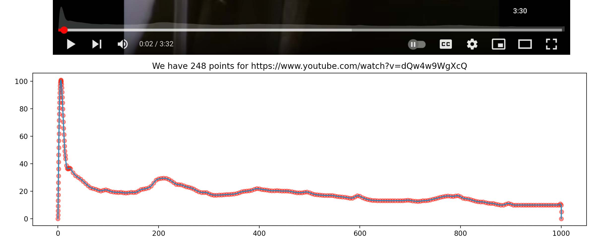

# YouTube Most Replayed Curve

Example on how to retrieve the "most replayed" curve from YouTube

</a>

`python test.py https://www.youtube.com/watch\?v\=dQw4w9WgXcQ --chromedriver-path ./chromedriver --wait-time 10`

Errors you can expect using this script without modification:
- Adverts are not handled, you'll get a timeout
- If there is no heatmap, you'll get an error
- If the class name or attribute name changes, it won't find the element

